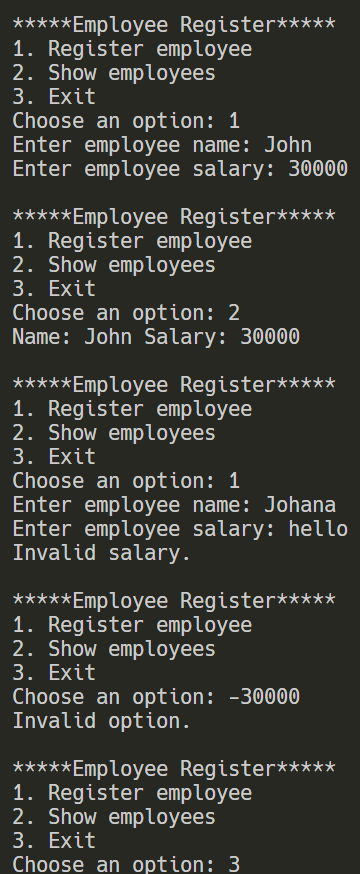

# Övning 1 — Personalregister — EmployeeRegister

1. Add to source control nere i högra hörnet, välj git, Alternativt Git menyn Create Git
   Repository
2. Kryssa UR Checkboxen Private
3. Create and Publish
4. Kontrollera att repositoriet skapats i webbläsaren och alla filer finns med. Om så är
   fallet kan du hoppa över resten. Annars följ nästa steg.
5. Gå till git changes i Visual Studio.
6. Skriv in ett commit meddelande tryck på Commit
7. Efter det Push med pilen uppåt. Alternativt Sync med två pilar i en cirkel.
8. Kontrollera enligt punkt 4.
9. Klart

# Bakgrund

Ett litet företag i restaurangbranschen kontaktar dig för att utveckla ett litet personalregister.
De har endast två krav:

1. Registret skall kunna ta emot och lagra anställda med namn och lön. (via inmatning i konsolen, inget krav på persistent lagring)
2. Programmet skall kunna skriva ut registret i en konsol.

# Uppgift 1 | Vilka klasser bör ingå i programmet?

The program should include one main class:

Employee: Represents an employee. The class contains the employee's name and salary. It also contains a constructor to create an employee and a method to display the employee's information.

# Uppgift 2 | Vilka attribut och metoder bör ingå i dessa klasser?

Entity/Class: Employee

Properties:
Name — stores the employee's name.
Salary — stores the employee's salary.

Constructor:
Employee(string name, int salary) — creates a new employee with a name and salary.

Method:
DisplayInfo() — displays the employee's name and salary in the console.

The program also uses a List<Employee> to store the registered employees.

# Uppgift 3 | Skriv Programet

- Försök göra programmet så robust och framtidssäkert som möjligt!
- Ni får gärna lägga på extra funktionalitet!
- Bonus för att implementera test! (men inte på bekostnad av att den andra koden blir
- lidande)
- Koden ska ligga uppe på GIT senast imorgon kl. 10.00
- Lycka till!

The program allows the user to:
Register a new employee.
Enter the employee's name and salary.
Store employees in a list.
Display all registered employees.
Exit the program.

The program also validates the employee's name and salary input.

# Extra functionalities

- xUnit Test Project (EmployeeRegister.Tests) (implemented)
- Full "CRUD"  (to be implemented)
